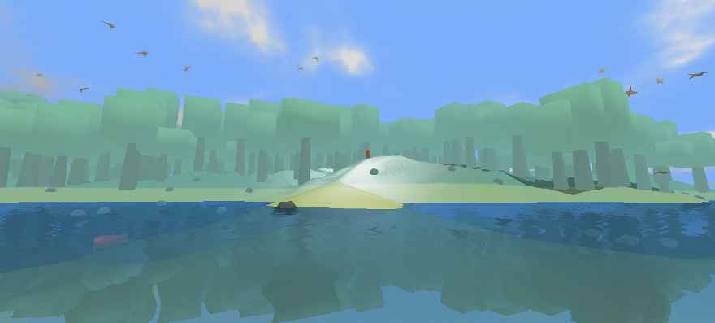

# Hands on VR

Some prerequisites :
* Browse to the [workshop repository page](https://github.com/mgsx-dev/pd-vr-workshop) and download as ZIP.
  * If you're familiar with GIT and Github, just clone this repository on your computer.
  * If not, just download it as ZIP and extract it on your computer.
* You need to [download and extract the latest version](https://github.com/mgsx-dev/pd-vr-workshop/releases) of the game and follow instructions provided in the zip file.
* required software :
  * [Pure Data vanilla 0.47.x](https://puredata.info/downloads/pure-data/releases)
  * Java 1.7+
  * [Audacity](http://www.audacityteam.org/download/)

## Subject

This course is based on a concrete situation : You will work on an open world 3D game under development.

The game is sending events and information based on its current state.

Based on these information you have to improve immersion by implementing the audio part with Puredata.

## Goals

* Spawn procedural sound FX on map toggle
* Implement an audio chest detector
* Basic 3D spatialization of chests as audio emitter
* Add sample based ambiant soundscape and effects based on environement
* Spawn sample based sounds based on player movements and effects based on environement
* Advanced 3D spatialization of music from the house

# Open World

This course provides :

* a work in progress version of an open world game sending events to Puredata through local network.
* a small Puredata patch library to speedup your development process.
* a Puredata patch template where you will code the game audio engine.

Information provided by the game :

* map toggle on/off message
* some messages sent continuously (60 time per seconds) including :
  * camera information (position, orientation)
  * The 3 nearest chest (position, a seed and occlusion factor)
  * environement information (altitude, forest and water factor)
  * player related information (speed, kind of movement : walking, swiming, diving...)

