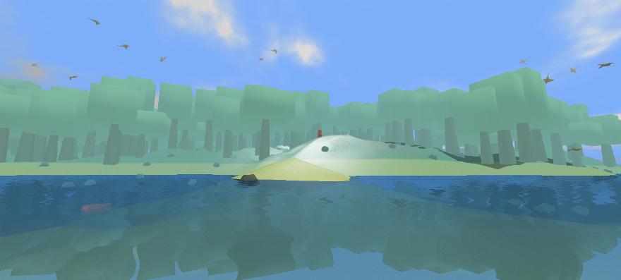

# Outline

## prerequisites

* Browse to the [workshop repository page](https://github.com/mgsx-dev/pd-vr-workshop) and download as ZIP.
    * If you're familiar with GIT and Github, just clone this repository on your computer.
    * If not, just download it as ZIP and extract it on your computer.
* You need to [download and extract the latest version](https://github.com/mgsx-dev/pd-vr-workshop/releases) of the game and follow instructions provided in the zip file.
* required software :
    * [Pure Data vanilla 0.52+](https://puredata.info/downloads/pure-data/releases)
    * Java 1.7+
    * [Audacity](http://www.audacityteam.org/download/)

## Goal

This course is based on a concrete situation : You will work on an open world 3D game under development.

The game is sending events and information based on its current state.

Based on these information you have to improve immersion by implementing the audio part with Puredata.

This course provides :

* a work in progress version of an open world game sending events to Puredata through local network.
* a small Puredata patch library to speedup your development process.
* few examples and demo to help you design your patch.
* a Puredata patch template where you will code the game audio engine.

## Information provided by the game

All messages (except map toggle) are sent continuously by the game 60 times per seconds.

* map toggle on/off message (by pressing SPACE key in the game)
* camera information (position, orientation)
    * used to compute distance from an object and head orientation in relation to other objects.
    * Y axis value is used to know whenether camera (player ears) is under the sea.
* The 3 nearest chest (position, a seed and occlusion factor)
    * used for chest detector exercice
* environement information (altitude, forest and water factor)
    * altutude is player's foot position on Y axis : helpful to know if player walk on group or in water.
    * altitude can be used to play wind at high altitude.
    * forest and water factor provide a rate of these 2 environment by sampling around the player.
* player related information (speed, kind of movement : walking, swiming, diving...)
    * speed can be used to control foot steps speed
    * state is used to switch from swimming sound, diving sound
    * state changes can be used to trigger sounds like dive in or dive out
* animals : for each 3 animal types, the 3 closest animals (you receive up to 3 birds, 3 bears, and 3 fishs) with their state, position and occlusion factor :
    * position is used for spatialization
    * occlusion can be used to attenuate sounds when animal is behind some objects (occluded)
    * state can be used to play different sounds depending on animal state :
        * by default, animals are in STROLL state and behave normally.
        * when player get too close (<10m), animal panics and switch to FLEE state.
        * when player get far enough (>30m), animal calm down and switch back to STROLL state.

